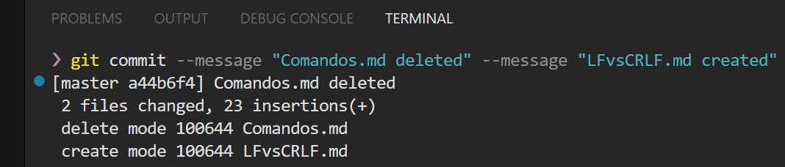

# Git Commit Example

Below is an example of a Git commit output in a terminal window:

## Descripción del Commit

Este commit muestra las siguientes acciones realizadas en una rama de Git:

- Se ha realizado un commit en la rama `master`.
- El hash abreviado del commit es `a44b6f4`.
- El mensaje del commit indica que un archivo `Comandos.md` ha sido eliminado y un archivo `LFvsCRLF.md` ha sido creado.
- El resumen del commit muestra que 2 archivos han cambiado con 23 inserciones.
- Se ha eliminado un archivo con el modo `100644`, que indica un archivo regular no ejecutable.
- Se ha creado un nuevo archivo con el mismo modo `100644`.

Estos cambios están ahora guardados en el historial de Git de la rama `master`.
